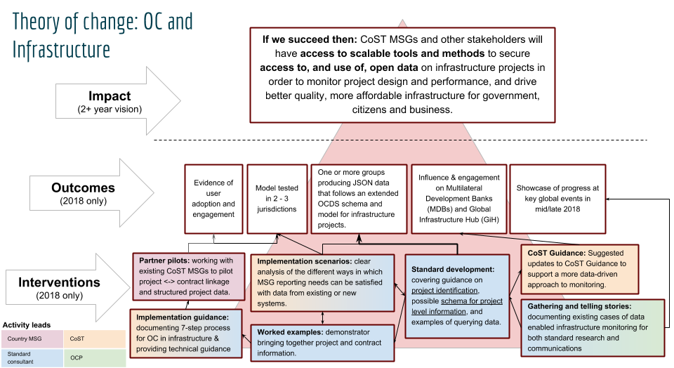

# Open Contracting and Infrastructure Transparency: data-driven disclosure

The [Open Contracting Partnership](http://www.open-contracting.org), [CoST](http://www.constructiontransparency.org/) and [Open Data Services Co-operative](http://www.opendataservices.coop) are working together to document how the [Open Contracting Data Standard](http://standard.open-contracting.org), and additional standardised data models, can be used to represent, share and analyse all the information required under the CoST proactive disclosure standard for infrastructure.

  

This repository tracks the technical development work for this collaboration, and will be used to share project outcomes.

You can get involved via the [issue tracker](LINK_TO_ADD), or for more information about this work, contact [Bernadine Fernz](mailto:bfernz@open-contracting.org), Head of Infrastructure at the Open Contracting Partnership.

Read more about [Open Contracting and Infrastructure on the Open Contracting Partnership Blog](https://www.open-contracting.org/tag/infrastructure/)

## Background

The Open Contracting Data Standard is already used to describe millions of procurement processes around the world relating to goods, services and public works.

CoST, the Infrastructure Transparency Initiative, has identified [40 key items of information](http://www.constructiontransparency.org/documentdownload.axd?documentresourceid=31) that should be **pro-actively disclosed** for public works projects in order to support stakeholders to monitor these infrastructure projects, and to carry out assurance activities.

These 40 elements cover **the project phase** when an infrastructure project is being planned and prepared, and the **contract phase** when the _primary construction contract_ for a project is tendered, awarded and implemented.

In both phases, a lot of the information required may be captured through contracting process:

* Contracts are issued for planning, design and preparation work;
* Contracts are issued for construction of infrastructure;
* Contracts are issued for monitoring construction implementation.

When open contracting principles and practices are put in place, data about these contracting processes, and documents associated with them, should be openly available in standard formats.

By linking existing open contracting disclosure (and ensuring key fields and documents are provided) with project level information, new opportunities for data-driven infrastructure project monitoring are unlocked.

## Theory of Change and workplan

This project, running from June 2018 through to March 2019, has the following Theory of Change.



The technical development workplan consists of the following four components:

* **Supply and demand research (June/July 2018)** - exploring the extent to which existing open contracting data can be used to understand major infrastructure projects and fulfil reporting requirements of the CoST Infrastructure Data Standard.

* **Project identifier research (June/July 2018)** - identifying the opportunities to bring together data on projects through use of unique project identifiers.

* **Schema and guidance development (July/August 2018)** - providing a clearly documented approach to the use of the core Open Contracting Data Standard (and extensions if appropriate) to provide the proactive disclosures required by CoST, and outlining implementation models for this.

* **Implementation resources (October 2018 - February 2019)** - creating guidance for implementers seeking to deploy the open contracting data standard for infrastructure projects

## In this repository

This repository contains a draft profile for the Open Contracting Data Standard, along with schema for a Project Level Data Specification that assists in meeting the requirements of the CoST Infrastructure Disclosure Standard.

### Getting started

The documentation is built using sphinx, building on the [standard profile template](https://github.com/open-contracting/standard_profile_template).

To build the documentation, first set-up a virtual environment with:

```
python3 -m venv .ve
source .ve/bin/activate
pip install -r requirements.txt
```

Then run

```
make
```

To preview documentation locally, run

```
python -m http.server
```

and access the documents at http://localhost:8000/build/en/

To deploy the documentation to Github Pages, assuming this repository is checked out in /infrastructure/, then checkout a second copy of this repository to /gh-pages/ and:

* Run `make` in /infrastructure/
* Switch to the parent directory, and run the following commands

```
cd gh-pages
git checkout gh-pages
git rm -rf *
cp -R ../infrastructure/build/en/* .
git checkout master -- README.md
git checkout master -- LICENSE
git checkout master -- assets
echo "" > .nojekyll
git add *
```

* Commit the changes in /gh-pages/ and push live
