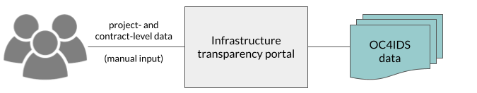
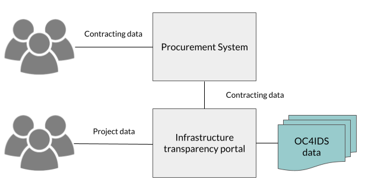
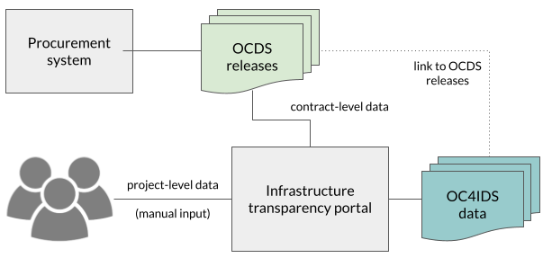
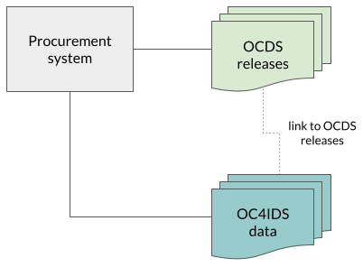

# Implementation models

OC4IDS implementation involves combining data on infrastructure projects and contracting processes. This guidance describes some examples of implementation models used by OC4IDS publishers. It is not an exhaustive list, but it can be used to inform your implementation.

Sources of data can include infrastructure transparency portals, procurement systems and project administration systems. OC4IDS implementation can also involve using contracting data published in OCDS format.

In this guidance we discuss options for the collection of data, the flow of data between systems and the publication of data. For more information about the design of the system architecture to support this process, see the [System Architectures](https://standard.open-contracting.org/latest/en/guidance/build/system_architectures/) guidance in the OCDS documentation.

## Standalone infrastructure transparency portal

In this model, procuring entities enter project and contract level data directly into an infrastructure transparency portal. The portal publishes project data and summary contracting process data in OC4IDS format. CoST Honduras uses this model in [SISOCS](https://sisocs.org/), as does CoST West Lombok in [INTRAS](http://intras.fllajlombokbaratkab.or.id/).

The main benefit of this approach is that it is relatively simple because it does not involve integrating data from different systems. The downside of this approach is that it can increase the data entry burden on procuring entities who might also need to enter contracting process data into a separate procurement system.

## Integrated infrastructure transparency portal and procurement system

In this model, procuring entities enter project data directly into an infrastructure transparency portal, whilst contracting process data is imported from an existing procurement system. The portal then publishes project data and summary contracting process data in OC4IDS format.

For each project, the infrastructure transparency portal needs to join up the project data entered by the procuring entity with contracting data imported from the procurement system. If the contracting data includes [project identifiers](https://standard.open-contracting.org/infrastructure/latest/en/guidance/identifiers/#local-project-identifiers-in-contracting-data), this process can be automated. Otherwise, procuring entities need to manually associate contracts with projects.

CoST Ukraine uses this model in its [infrastructure transparency portal](https://portal.costukraine.org/), which imports data from Prozorro, the national procurement system. Project identifiers are not captured in [Prozorro](https://prozorro.gov.ua/en) so procuring entities manually match contracts to projects.

The main benefit of this approach is reducing the data entry burden on procuring entities, who need only enter contracting data in one system. When the data from the procurement system includes project identifiers, the burden is further reduced since the transparency portal can match contracts to projects without manual intervention. The downsides of this approach are increased complexity of the transparency portal and the potential need for development work on the procurement system to enable access to its data.

When the procurement system publishes OCDS data, there are two further benefits:

* OC4IDS Kit’s [convert-from-ocds](https://oc4idskit.readthedocs.io/en/latest/cli.html#convert-from-ocds) command can be used to generate OC4IDS data using the OCDS data as an input, reducing the amount of software development needed.
* The published OC4IDS data can be linked to the OCDS data from the procurement system, allowing users to dig deeper into detailed data about the contracting processes related to each project.

Nuevo León’s [Infraestructura Abierta platform](https://smpu.nl.gob.mx/transparencia/) implements a similar model:

* Internal systems collect, combine and publish project and contracting data using OC4IDS and OCDS.
* The Infraestructura Abierta platform consumes the OC4IDS and OCDS data and provides an interface for users to explore and analyze the data.

For more information on Nuevo León’s implementation, read the [Technical case study](https://docs.google.com/document/d/1oIBk9gnpiq5dcZkahiZ2kI1v5kwt9NTlRkdKNm4LhVA/edit#).

## Standalone procurement system

In this model, rather than implementing a separate infrastructure transparency portal, an existing procurement system is extended to collect project data. Procuring entities enter project data and contracting data directly into the procurement system and associate contracts with projects. The system publishes project data and summary contracting data in OC4IDS format and detailed contracting data in OCDS format. The OC4IDS data meets the needs of users with an interest in infrastructure projects and the OCDS data meets the needs of users with an interest in all types of contracting process.

Uganda’s Public Procurement and Disposal of Public Assets Authority uses this model in its [Government Procurement Portal](https://gpp.ppda.go.ug/).

The main benefit of this model is that it does not require the development of a separate infrastructure transparency portal. The downside of this model is that it might involve significant changes to legacy procurement systems.
