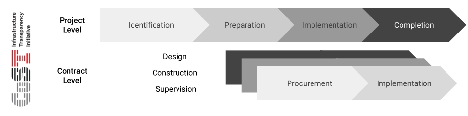
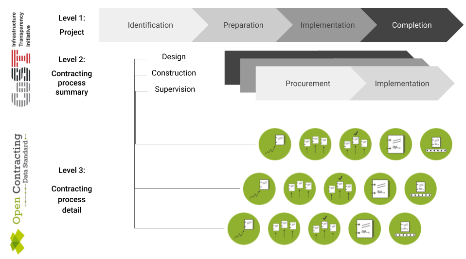

# Getting started

The regular disclosure of structured data can greatly enhance the transparency and accountability of publicly funded construction projects. Using a common schema to record the information that is needed to monitor projects can enable more advanced analysis, both within, and across, infrastructure projects.

## What is a project?

An infrastructure project may stand alone (e.g. a town building a new hospital), or may form part of a wider programme of activity (e.g. construction of a number of railway stations). Each infrastructure project will usually involve project-level planning and co-ordination, managed through a series of contracts and subcontracts.

```eval_rst
.. admonition:: Tip
    :class: tip

    .. markdown::

      The term 'project' can also be used to refer to a larger programme of work of which an individual infrastructure project is a part, such as the construction of a whole highway. The term 'project' may also refer to a public investment project with funds allocated in the national budget, such as the upgrading of the rail network in a particular region.

      However, in OC4IDS, the term 'project' refers to the construction of a single asset, for example the construction of a bridge, a highway junction or building.


```


Within an infrastructre project, a public body may issue contracts within contracting processes for design work, construction and supervision or monitoring of the construction work. Budgets, planning and impact assessments are likely to cut across all these components of a project.

## What is project-level data?


[CoST](http://infrastructuretransparency.org/) have developed a framework of information that should be pro-actively disclosed and kept updated at each stage. Project-level data covers:

* **identification** - the decision to develop a project within the budget and programme of a project owner.
* **preparation** - the feasibility study, environmental and social impact assessment, general scoping of the project, establishing the packaging and procurement strategy, preliminary statutory requirements on environmental and land impacts, and the resulting budget authorisation.
* **implementation** - covers the procurement and implementation of the planning, design and works according to the procurement strategy.
* **completion** - covers the handover of the assets and close-out activities with details of the final scope, cost, and delivery time.

This framework has been used as the basis for OC4IDS.

## How does contracting data fit in?



The preparation and implementation stages may be delivered using contractors. This will lead to one or more contracting processes, each with their own planning, tender, award, contract and implementation stages.

Monitoring an infrastructure project may largely involve monitoring the contracts used to deliver it: particularly any primary construction contracts.

It may be possible to [discover and populate some data about infrastructure projects by looking at contracting data](../../guidance/using.md), and to use data from contacting data systems in order to detect updates and modifications during a contracting process. In other cases, it is simply necessary to record details of each contract related to an infrastructure project, and to manually monitor any modifications to these contracts.

## How is OC4IDS structured?



OC4IDS is structured in three parts:

### Project-Level Data

Project-level data includes summary information on project identification, preparation and completion.

### Contracting process summaries

The `contractingProcesses` array may be used to provide a summary of each of the contracting processes that is used to support preparation and implementation in the `summary` section.

Information on these processes may be manually entered, or, where OCDS data is available, may be automatically populated from OCDS data via a push or pull mechanism.

The `modifications` section should be used to record information on changes to the contracting process, either linked to OCDS releases or recorded manually.

### Contracting process details

Where OCDS data is available, the `contractingProcesses/releases` array should act as an index of (cached) OCDS releases, recording each update to a contracting process.

Explanations of any modifications detected when comparing releases should be provided in the `modifications` section of the contracting process summary.

## How can I use OC4IDS?

### If you have an existing infrastructure transparency portal...

**... you can add an OC4IDS export option to your system.**

**Why?**

So that your project information can be compared with information from others, and to support the development of common tools for analysis of infrastructure project information. There are already many tools that work with contracting process data in OCDS format.

```eval_rst
.. admonition:: Step by step
    :class: tip

    .. markdown::

      Refer to the guidance on [publishing data from an infrastructure transparency portal](../guidance/publishing-from-portal.md) for a step by step guide.

```

### If you are designing a new infrastructure transparency portal...

**... OC4IDS can be used by structure your data collection.**

**Why?**

The specification has been designed to help you collect well structured data, comparable across contexts, and with all the fields needed to make sure the data is clear and unambiguous. It has been design to integrate with existing open contacting data sources, but to also work in cases where structured open contracting is not available.

Some of the data structures, such as the organisation identifier structure, may require additional data collection, but if populated with data, allow connections to be made between project data, company registers and beneficial ownership information.

```eval_rst
.. admonition:: Things to consider
    :class: tip

    .. markdown::

        Whilst the schema can be used directly to build a data entry form, user interfaces should always be designed around user needs.

        Data can be stored directly in the JSON structure described by the schema of the specification **or** it can be stored in custom data structures, and only converted to the specification's structure when importing or exporting data.

```
### If you are designing other data collection tools...

... OC4IDS provides definitions and codelists that can be used to collect consistent data.

Consult the [specification reference for definitions](../reference/index.md).
