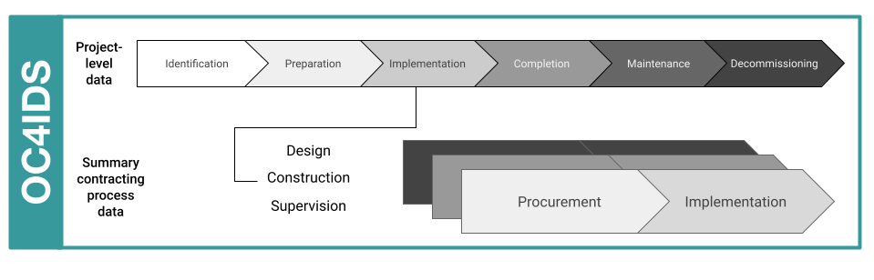
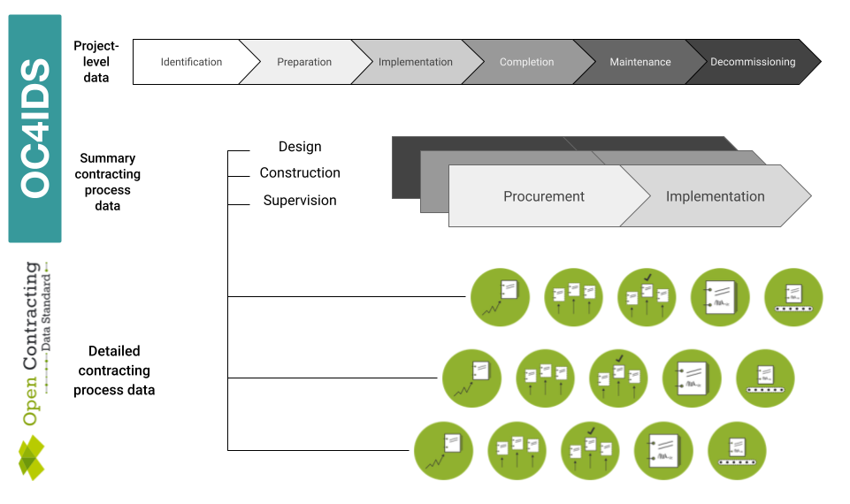
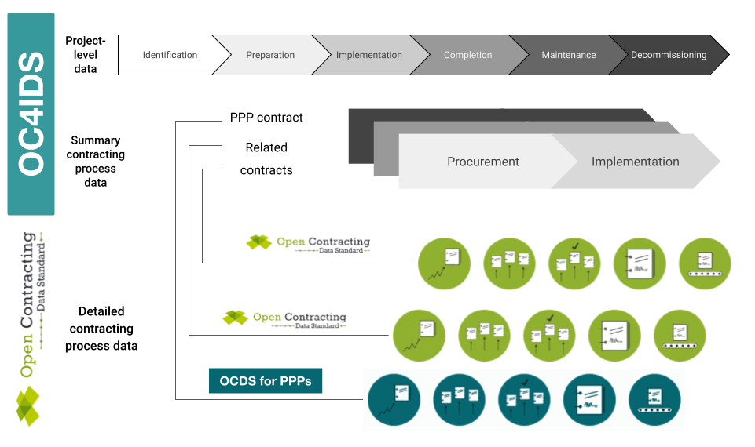

# Getting started

The regular disclosure of structured data can greatly enhance the transparency and accountability of publicly funded infrastructure projects.

Publishing standardized data makes using data easier, for example to compare data across projects. It also supports the development of reusable tools and methodologies.

## What is a project?

In the context of OC4IDS, the term ‘project’ refers to an infrastructure project, defined as the development of a set of infrastructure assets in a specified location, generally the responsibility of a single procuring entity and budget authority: for example, a highway overpass or a university campus.

An infrastructure project can stand alone (e.g. a new hospital), or can form part of a wider investment project or programme of work (e.g. a new rail station, as part of an extension to a railway line).

Within an infrastructure project, a procuring entity can initiate multiple contracting processes for the project design, construction or supervision.


```{tip}
The term "project" is used in many contexts to mean different things. In OC4IDS, the term "project" only refers to an infrastructure project and not to an investment project, investment program, or budget code.
```

## What is the scope of OC4IDS?

OC4IDS describes how to structure and format the disclosures described by the CoST IDS.

The CoST IDS is a best practice framework for disclosure on infrastructure projects. It describes what information to disclose to support monitoring of infrastructure projects.

The CoST IDS and OC4IDS cover project-level data and summary contracting process data.

### What is project-level data?


Project-level data relates to the project as a whole and covers the following stages:

* **Identification** - the decision to develop a project within the budget and programme of a project owner.
* **Preparation** - the feasibility study, environmental and social impact assessment, general scoping of the project, establishing the packaging and procurement strategy, preliminary statutory requirements on environmental and land impacts, and the resulting budget authorization.
* **Implementation** - covers the procurement and implementation of the planning, design and works according to the procurement strategy.
* **Completion** - covers the handover of the assets and close-out activities with details of the final scope, cost, and delivery time.

### What is summary contracting process data?


Summary contracting process data relates to the contracts used to deliver the project and covers the following stages:

* **Procurement** - the procuring entity and process; contract type and status; number of bidders; cost estimate and contract price; suppliers; scope of work and start date and duration of the contract.
* **Implementation** - variations to contract price, duration and scope, and reasons for these changes.

CoST recommends disclosing data on contracts for the design, construction and supervision of a project and any other significant contract outsourced by the procuring entity.

## How is OC4IDS structured?



The top-level of the OC4IDS data model is used for project-level data, covering the identification, preparation and completion stages of a project.

Each project in OC4IDS can have many related contracting processes.

The `contractingProcesses` array can be used to provide a summary of the procurement and implementation of each contracting process related to the project.

The `contractingProcesses/modifications` section can be used to record information on changes to each contracting process.

## How does detailed contracting data fit in?

Alongside project-level data and documents, monitoring an infrastructure project can largely involve monitoring the contracts used to deliver it, particularly any primary construction contracts.

It is possible to use contracting data to identify infrastructure projects for monitoring. It can also be used to monitor projects for changes to costs, timescales and scope. Each change you identify can be recorded in the summary contracting process data section of OC4IDS, along with an explanation.

Where detailed contracting data is published using the [Open Contracting Data Standard](http://standard.open-contracting.org), the `contractingProcesses/releases` array in OC4IDS can be used to link to OCDS releases, recording each update to a contracting process.

OCDS is used to disclose detailed data on contracting processes for goods, works and services. It covers all stages of a contracting process: planning, initiation, award, contract and implementation.



OCDS data can be used to identify and monitor infrastructure projects. It can also be used to produce OC4IDS data. Converting OCDS data to OC4IDS data can reduce the amount of manual data entry necessary for infrastructure project monitoring.

```{admonition} Tool
:class: tip

OCDS Kit's [convert-to-oc4ids](https://ocdskit.readthedocs.io/en/latest/cli/ocds.html#convert-to-oc4ids) command can be used to generate an OC4IDS file from OCDS data about the contracting processes related to an infrastructure project.
```

## How do PPPs fit in?

Infrastructure projects can be procured in different ways, including through Public-Private Partnerships.

Where data on PPP projects is published using OCDS for PPPs, the `contractingProcesses/releases` array in OC4IDS can be used to link to OCDS for PPPs releases.



## Why use OC4IDS?

Publishing your data using OC4IDS means that it can be compared with data from other publishers and supports the development of reusable tools for analysis of infrastructure project data. OC4IDS data can also  be linked with other critical documents such as project pipelines and public sector budgets to allow for the tracking of the project from its identification to completion across different government institutions.

OC4IDS is designed to help you collect well-structured data, comparable across contexts, and with all the fields needed to make sure the data is clear and unambiguous. It has been designed to integrate with existing open contracting data sources, but also to work in cases where structured open contracting data is not available.

## When can I use OC4IDS?

OC4IDS can be used in the following scenarios:

**Publishing structured data from an infrastructure transparency portal**

OC4IDS describes a standardized format for publishing structured data on infrastructure projects.

Read the guidance on [publishing data from an infrastructure transparency portal](https://standard.open-contracting.org/infrastructure/latest/en/guidance/publishing/).

**Designing a new infrastructure transparency portal**

OC4IDS describes the best practice information you ought to collect and disclose to support infrastructure project monitoring.

**Using OCDS data for whole life-cycle infrastructure project monitoring**

OC4IDS can be used to:

* Join up OCDS data published about contracts related to an infrastructure project
* Capture and record data about the project a contract relates to
* Record a list of changes to a contracting process and reasons for those changes

Read the guidance on [using data from procurement systems for infrastructure project monitoring](https://standard.open-contracting.org/infrastructure/latest/en/guidance/using/).

**Collecting data on infrastructure projects using a spreadsheet**

The OC4IDS schema can be used to generate a spreadsheet template for collecting data.

**Designing other data collection tools**

OC4IDS provides definitions for fields and codelists which can be used to collect consistent data.

**Publishing data that complies with the CoST IDS**

OC4IDS describes how to structure and format the disclosures described by the CoST IDS.

Review the [CoST IDS mapping](https://standard.open-contracting.org/infrastructure/latest/en/cost/) to learn how to publish each element of the CoST IDS using OC4IDS.

```{admonition} Are you ready to start using OC4IDS?
:class: Tip

Complete the [OC4IDS scoping template](https://www.open-contracting.org/resources/oc4ids-scoping-template/) and share it with the [OC4IDS helpdesk](mailto:data@open-contracting.org).
```
